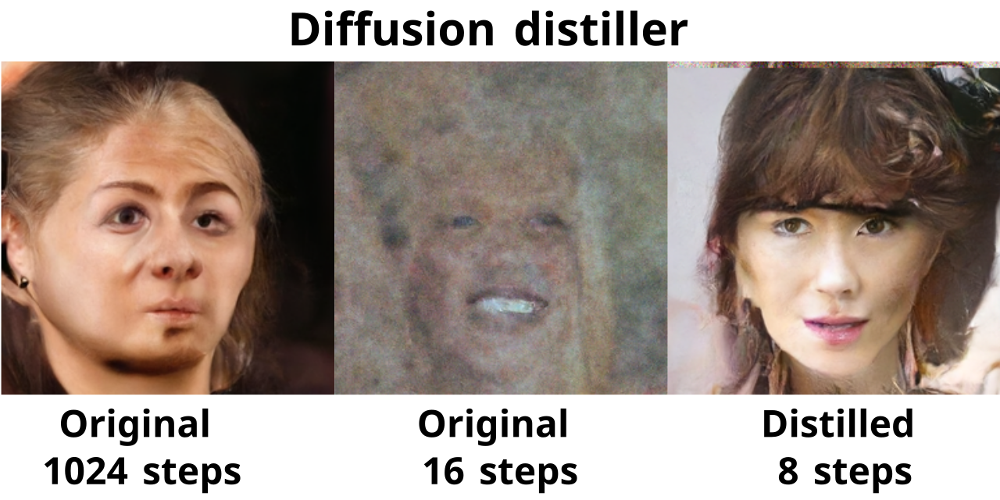
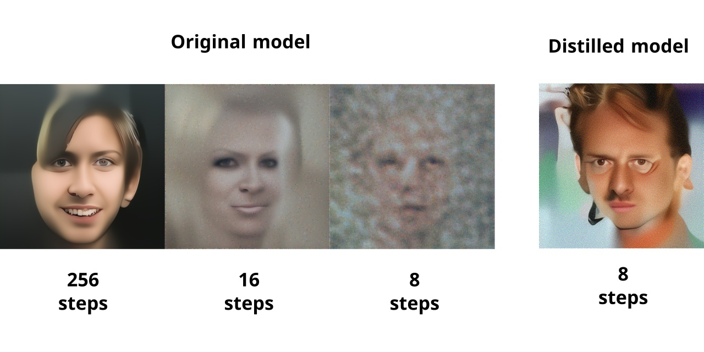

# PyTorch Implementation of "Progressive Distillation for Fast Sampling of Diffusion Models(v-diffusion)"

Unofficial PyTorch Implementation of [Progressive Distillation for Fast Sampling of Diffusion Models](https://openreview.net/forum?id=TIdIXIpzhoI).

Distiller makes diffusion models more efficient at sampling time with progressive approach. 
An algorithm iteratively reduces number of required diffusion steps by half, using optimization of basic model. 
Distillation is applied to the model several times, so it becomes possible to sample images in 8 or even 4 diffusion steps.  

The figure below shows the results of the DDPM model for the Celeba HQ 256x256 dataset. 
The left image was generated in the initial 1024 steps. 
The image in the center was obtained by sampling from an unchanged model with a reduced number of steps to 16. 
The image on the right is generated by a distilled model in 8 steps. 
As can be seen, distillation has made it possible to achieve a significant reduction in the time for image generation by diffusion model with a slight degradation in an image quality.

## What's different from the official paper?

DDPM model was used without authors modification.

Rosanality DDPM images [sampler](https://github.com/rosinality/denoising-diffusion-pytorch) was used by default.

## Images generation

Unpack pretrained [weights](https://cloud.mail.ru/public/mQGz/k1pNzg2ng) in the `checkpoints` folder.

Sampling from the distilled model:

`python ./sample.py --out_file ./images/celeba_u_6.png --module celeba_u --checkpoint ./checkpoints/celeba/base_6/checkpoint.pt --batch_size 1` 

To sample from the original model run:

`!python ./sample.py --out_file ./images/celeba_original_ts128.png --module celeba_u --time_scale 1 --checkpoint ./checkpoints/celeba/original/checkpoint.pt --batch_size 1`

Using the parameter `time_scale`, you can specify the number of skipped steps. 

## How to distillate your own diffusion model?

To optimize an arbitrary diffusion model:
1. Save pretrained checkpoint with command like: `torch.save({"G": model.state_dict(), "n_timesteps": num_timesteps, "time_scale": 1.0},`, where `G` should contain your model parameters, `n_timesteps` - number of model diffusion steps, and `time_scale` should be set to `1.0`.
Note: it is assumed that the model uses DDPM cosine time schedule and can predict `v` for example, using `x` and `eps`, otherwise you can retrain a model with `train.py` script.   
2. Make a script like `celeba_u.py` with `make_model` - function that creates model and `make_dataset` - train dataset creator.
Note: model should contain attribute `image_size = [1 C H W]` of generated images.
3. Run `python ./distillate.py --module YOUR_MODULE --diffusion GaussianDiffusionDefault --name CHECKPOINTS_DIR --dname base_0 --base_checkpoint ./PATH/TO/CHECKPOINT.pt --batch_size 1 --num_workers 4 --num_iters 5000 --log_interval 10`.
Distiller uses `tensorboard` on training. You can run it in checkpoints directory to view training status.
4. After training run: `python ./sample.py --out_file ./PATH/TO/IMAGE.png --module YOUR_MODULE --time_scale 1 --checkpoint ./PATH/TO/DISTILLED/CHECKPOINT.pt --batch_size 1` to sample images. 

## How does diffusion_distiller works?

Progressive distillation starts with initializing distilled model with basic model weights. 
Like in standard training, algorithm sample data from the training set and add noise to it, 
but the target of distilled model is not to reconstruct the input data, but repeat the output of 
basic model, which makes two denoise steps on the input image.

Training in this mode is much easier than training DPM with a reduced number of steps due to the two tricks proposed in the article: 
1. Denoising by the basic model is performed with the same `eps` for both steps, so only one output corresponds to one input, and not an infinite set as in the basic DDPM. 
2. Instead of reconstructing `x` or `eps`, a special parameter `v = alpha_t*eps - sigma_t*x` is restored, which is more sensitive and allows model to get sharper images.

Thus, the trained model repeats the behavior of the base model, only with the number of diffusion steps reduced by half.

## Training

_If you use `clipped sampler`(disabled by default), don't afraid the artifacts like [this](./images/artifacts.png). Artifacts may appear during training the base model and the first stages of distillation. They are caused by the features of the image sampling algorithm and will not occur at later stages._ 

Prepare lmdb dataset:

`python prepare_data.py --size 256 --out celeba_256 [PATH TO CELEBA_HQ IMAGES]`

Move `celeba_256` to `./data` folder.

Run `tensorboard --logdir ./` in `checkpoints` folder to watch the results.

Run training `celeba_u_script.ipynb` notebook.

## Clipped image sampling

You can try clipped image sampler, which generates more glossy images(`--clipped_sampling True` option). 

Try different values of `clipping_value` to see how the image quality changes.  

## Acknowledgement
1. [Progressive Distillation for Fast Sampling of Diffusion Models](https://openreview.net/forum?id=TIdIXIpzhoI).
2. [rosinality/denoising-diffusion-pytorch](https://github.com/rosinality/denoising-diffusion-pytorch).