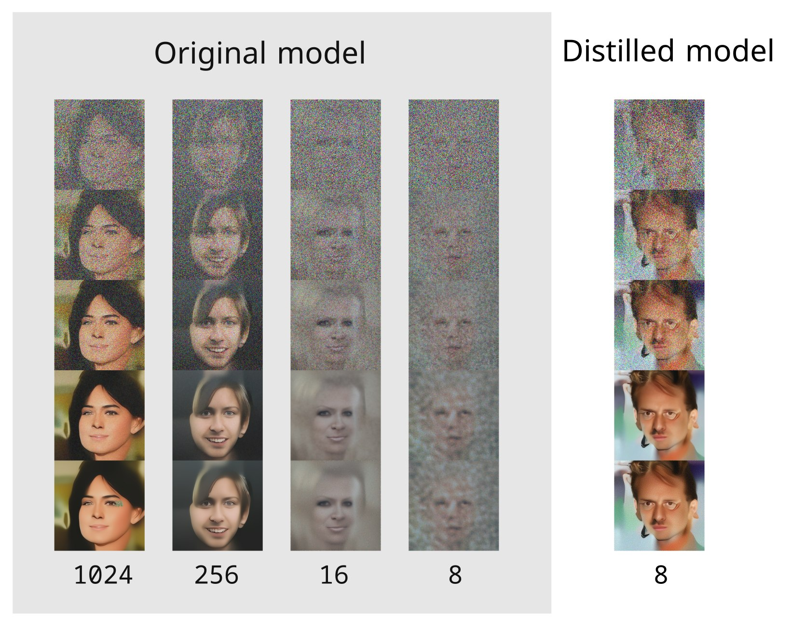

# PyTorch Implementation of "Progressive Distillation for Fast Sampling of Diffusion Models(v-diffusion)"

Unofficial PyTorch Implementation of [Progressive Distillation for Fast Sampling of Diffusion Models](https://openreview.net/forum?id=TIdIXIpzhoI)

V-Diffusion is an algorithm that creates a new model capable of sampling images in 2^N fewer diffusion steps.

## What's different from official paper?
DDPM model was used without authors modification.

## Training

_Don't afraid the artifacts like [this](./images/artifacts.png) during training the base model and the first stages of distillation. They are caused by the features of the image sampling algorithm and will not appear at later stages._ 

Prepare lmdb dataset:

`python prepare_data.py --size 256 --out celeba_256 [PATH TO CELEBA_HQ IMAGES]`

Move `celeba_256` to `./data` folder.

Run `tensorboard --logdir ./` in `checkpoints` folder to watch the results.

Run training `celeba_u_script.ipynb` notebook.

